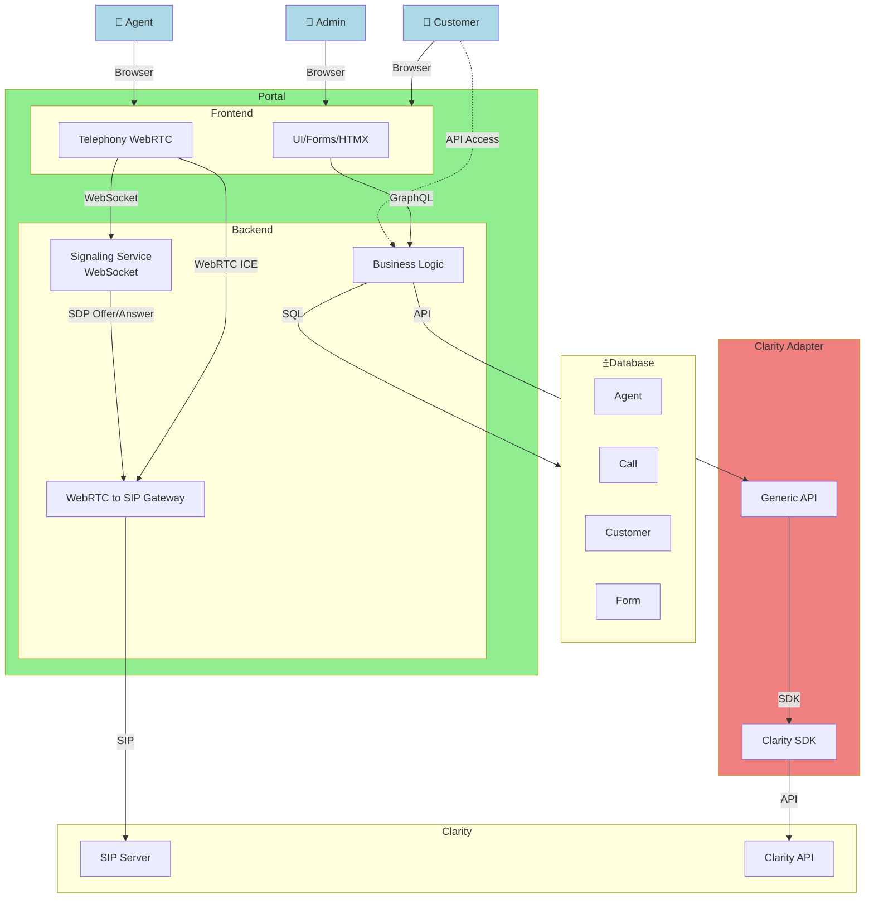

# WebRTC

This project is a test for using a purely Web based solution to use SIP telephony.



## Architecture

The application consists of three services managed by Docker Compose:

- **Traefik** — reverse proxy listening on port 80, routing traffic to frontend and backend based on path prefix
- **Frontend** — Go static file server serving the HTML/JS application
- **Backend** — Go WebSocket and REST API server for WebRTC-to-SIP signaling

Traefik routes:
- `/api/*` and `/ws` → backend service
- `/` (everything else) → frontend service

## Backend

The backend is written in Go and acts as a WebSocket server to handle signaling for WebRTC and SIP. It also provides a REST API for the frontend to interact with.

### Fail-early behavior

The backend will refuse to start if any of the required SIP configuration values (`SIP_SERVER`, `SIP_USERNAME`, `SIP_PASSWORD`, `SIP_DOMAIN`) are missing or empty.

## Frontend

The frontend is a simple HTML/JavaScript application that allows users to make and receive calls using WebRTC. It connects to the backend via WebSocket for signaling and uses the REST API for other interactions.

### Fail-early behavior

The frontend will attempt to reach the backend health endpoint (`BACKEND_URL + /api/health`) up to 5 times with 2-second delays before starting. If the backend is unreachable after all retries, the frontend exits with a non-zero code.

## Configuration

### Backend environment variables

| Variable        | Default  | Required | Description                         |
|-----------------|----------|----------|-------------------------------------|
| `SIP_SERVER`    | —        | Yes      | SIP server address                  |
| `SIP_USERNAME`  | —        | Yes      | SIP username                        |
| `SIP_PASSWORD`  | —        | Yes      | SIP password                        |
| `SIP_DOMAIN`    | —        | Yes      | SIP domain                          |
| `LISTEN_ADDR`   | `:8080`  | No       | HTTP listen address                 |
| `LOG_LEVEL`     | `info`   | No       | Log level (`debug`, `info`, `warn`, `error`) |
| `API_BASE_PATH` | `/api`   | No       | Base path prefix for API endpoints  |

### Frontend environment variables

| Variable       | Default               | Required | Description                          |
|----------------|-----------------------|----------|--------------------------------------|
| `BACKEND_URL`  | `http://backend:8080` | No       | Backend URL (used for health check)  |
| `LISTEN_ADDR`  | `:3000`               | No       | HTTP listen address                  |
| `LOG_LEVEL`    | `info`                | No       | Log level (`debug`, `info`, `warn`, `error`) |

## Quickstart

```bash
docker-compose up --build
```

Then open [http://localhost](http://localhost) in your browser.

## Routing

All external traffic enters through Traefik on port 80:

- Frontend: [http://localhost/](http://localhost/)
- Backend health: [http://localhost/api/health](http://localhost/api/health)
- Backend status: [http://localhost/api/status](http://localhost/api/status)
- WebSocket: `ws://localhost/ws`

## Container Images

Images are automatically built on every push to `main` and on pull requests (to validate the build). Images are only **pushed** to the GitHub Container Registry (GHCR) when a version tag matching `x.x.x` (e.g. `1.2.3`) is created.

- `ghcr.io/dkrizic/webrtc-backend`
- `ghcr.io/dkrizic/webrtc-frontend`

Tag strategy:
- Git tag `1.2.3` → image tags `1.2.3` and `latest`
- Push to `main` or pull request → build only (not pushed to registry)

## Testing

Test the application locally after starting with `docker-compose up --build`:

```bash
# Frontend
curl http://localhost/

# Backend health
curl http://localhost/api/health

# Backend status
curl http://localhost/api/status
```
