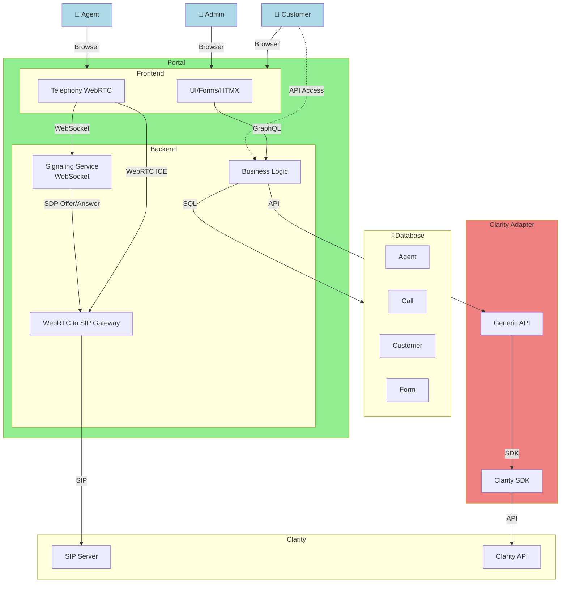

# WebRTC

This project is a test for using a purely Web based solution to use SIP telephony.

## Backend

The backend is written in Go and acts as a WebSocket server to handle signaling for WebRTC and SIP. It also provides a REST API for the frontend to interact with.

## Frontend

The frontend is a simple HTML/JavaScript application that allows users to make and receive calls using WebRTC. It connects to the backend via WebSocket for signaling and uses the REST API for other interactions.
