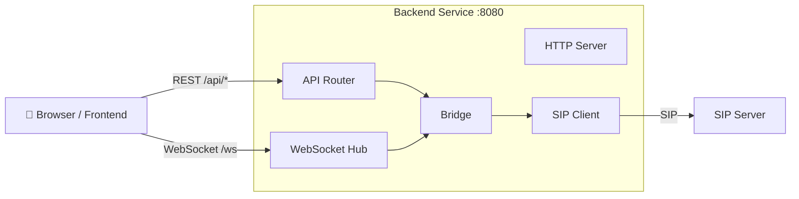

# WebRTC Backend

Go-based WebSocket and REST API server that acts as a WebRTC-to-SIP gateway. Handles SIP registration, incoming/outgoing call signaling, and bridges WebRTC clients to SIP endpoints.

## Architecture



## Package Structure

| Package | Description |
|---------|-------------|
| `cmd/server/` | Entry point |
| `internal/api/` | HTTP router, health and status endpoints |
| `internal/bridge/` | Bridges WebSocket signaling and SIP calls |
| `internal/config/` | Configuration struct |
| `internal/signaling/` | WebSocket hub for frontend communication |
| `internal/sip/` | SIP client for registration and call handling |

## How to Build

The backend is built using a multi-stage Dockerfile:

```bash
go build ./cmd/server
```

Or using Docker:

```bash
docker build -t webrtc-backend .
```

## Environment Variables

| Variable        | Default | Required | Description                                               |
|-----------------|---------|----------|-----------------------------------------------------------|
| `SIP_SERVER`    | —       | Yes      | SIP server address (host:port)                            |
| `SIP_USERNAME`  | —       | Yes      | SIP authentication username                               |
| `SIP_PASSWORD`  | —       | Yes      | SIP authentication password                               |
| `SIP_DOMAIN`    | —       | Yes      | SIP domain for registration                               |
| `LISTEN_ADDR`   | `:8080` | No       | HTTP listen address                                       |
| `LOG_LEVEL`     | `info`  | No       | Log level (`debug`, `info`, `warn`, `error`)              |
| `API_BASE_PATH` | `/api`  | No       | Base path prefix for REST API endpoints                   |

## API Endpoints

| Method | Path | Description |
|--------|------|-------------|
| `GET` | `{API_BASE_PATH}/health` | Health check — returns `200 OK` |
| `GET` | `{API_BASE_PATH}/status` | SIP registration status — returns JSON with `sip` and `phone_number` |
| `WS` | `/ws` | WebSocket endpoint for WebRTC signaling |

## Fail-Early Behavior

The backend refuses to start if any of the required environment variables (`SIP_SERVER`, `SIP_USERNAME`, `SIP_PASSWORD`, `SIP_DOMAIN`) are missing or empty.

## Container Image

```
ghcr.io/dkrizic/webrtc-backend
```

Images are tagged with the version (e.g. `1.2.3`) and `latest` on every release.

## Directory Structure

```
backend/
├── cmd/
│   └── server/        # Entry point (main.go)
├── internal/
│   ├── api/           # HTTP router, health and status endpoints
│   ├── bridge/        # Bridges WebSocket signaling and SIP calls
│   ├── config/        # Configuration struct
│   ├── signaling/     # WebSocket hub for frontend communication
│   └── sip/           # SIP client for registration and call handling
├── Dockerfile
├── go.mod
└── go.sum
```
