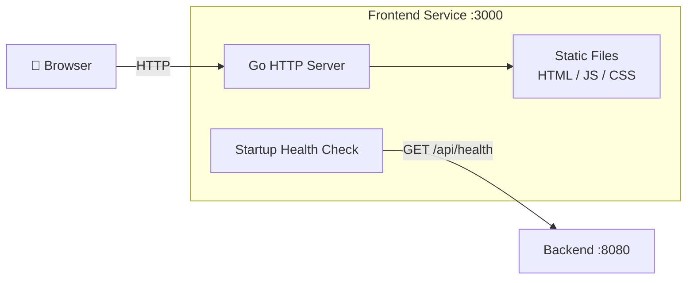

# WebRTC Frontend

Go-based static file server for the WebRTC SIP telephony frontend. Serves HTML/JS/CSS files and performs a health check against the backend before starting.

## Architecture



## How to Build

The frontend is built using a multi-stage Dockerfile:

```bash
go build ./cmd/server
```

Or using Docker:

```bash
docker build -t webrtc-frontend .
```

## Environment Variables

| Variable       | Default               | Required | Description                                               |
|----------------|-----------------------|----------|-----------------------------------------------------------|
| `BACKEND_URL`  | `http://backend:8080` | No       | Backend URL used for startup health check                 |
| `LISTEN_ADDR`  | `:3000`               | No       | HTTP listen address                                       |
| `LOG_LEVEL`    | `info`                | No       | Log level (`debug`, `info`, `warn`, `error`)              |

## Fail-Early Behavior

On startup the frontend performs a health check against `BACKEND_URL + /api/health`. It retries up to **5 times** with a **2-second delay** between attempts. If the backend is still unreachable after all retries, the process exits with a non-zero exit code.

## Container Image

```
ghcr.io/dkrizic/webrtc-frontend
```

Images are tagged with the version (e.g. `1.2.3`) and `latest` on every release.

## Directory Structure

```
frontend/
├── cmd/
│   └── server/        # Entry point (main.go)
├── static/            # Static files served to the browser (HTML, JS, CSS)
├── Dockerfile
├── go.mod
└── go.sum
```
